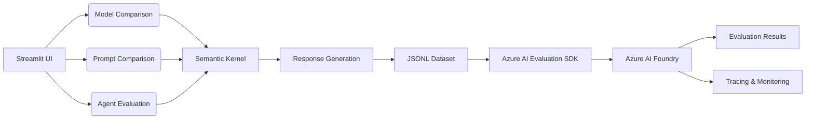

# AI Evaluation Kickstarter

AI Evaluation Kickstarter is a Streamlit-based application for comparing and evaluating AI models, prompts, and agents. It leverages Azure AI Evaluation SDK, Semantic Kernel, and OpenTelemetry to provide performance, quality, and safety metrics along with logging and monitoring.

## Features

- **Model Evaluation**: Compare outputs from two AI models across various metrics such as groundedness, relevance, coherence, fluency, and NLP scores (F1, BLEU, ROUGE, etc.).
- **Prompt Evaluation**: Evaluate and compare different system messages (prompts) on the same model to determine the best prompting strategy.
- **Agent Evaluation**: Run conversational agents built with Semantic Kernel or OpenAI Agent SDK, view conversation history, and assess agent behavior with custom evaluators.
- **Configurable Metrics**: Select from performance, quality, risk and safety, and agent-specific metrics in the sidebar.
- **Azure Integration**: Uses Azure AI Project, Azure OpenAI, and Azure Monitor (via OpenTelemetry) for evaluation, logging, tracing, and metrics.
- **Download Responses**: Export generated responses and datasets as JSONL files for further analysis.


## Deployment

1. Login with Azure Developer CLI

```bash
azd auth login
```

2. Run azd up

```bash
azd up
```

## Usage

Navigate to container app in your browser. The URL will be displayed in your console once the deployment has finished successfully. Alternatively, browse to the Azure Portal, find the Container App which was just deployed and click its URL. When you open the app:

1. Select evaluators in the sidebar.
2. Choose between Development and Production modes.
3. In Development:
   - **Evaluate Models**: Upload or enter test data, select two models and a judge LLM, then generate and evaluate responses.
   - **Evaluate Prompts**: Enter two system messages and a prompt, then compare model outputs and metrics.
   - **Evaluate Agents**: Run a chat agent, view conversations, and evaluate tool calls and agent behaviors.
4. Download JSONL datasets of responses for offline analysis if needed.

## Architecture

A high-level overview: the Streamlit UI drives three evaluation flows (model comparison, prompt comparison, and agent evaluation), each using Semantic Kernel for response generation. Generated outputs are compiled into a JSONL dataset, which is fed into the Azure AI Evaluation SDK to run evaluations in Azure AI Foundry. Evaluation results, along with tracing and monitoring data, are then surfaced in the UI and Azure Monitor.



## Contributing

Contributions welcome! Please open issues or pull requests for enhancements or bug fixes.

